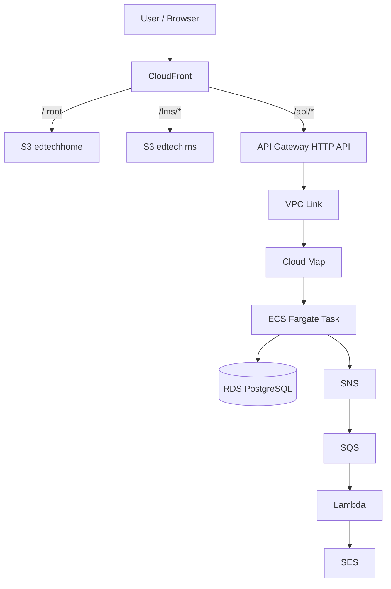

# EDTECH SYSTEM DESIGN (V2 – ULTRA COST-OPTIMIZED)

Tài liệu mô tả kiến trúc hệ thống EdTech, bám sát mã nguồn trong **backend** và **frontend** của repo, gồm hai mục lớn: **Tổng quan hệ thống** và **Lên kế hoạch triển khai**.

---

# PHẦN 1. TỔNG QUAN HỆ THỐNG

## 1.1 Mục tiêu và phạm vi

- **Tối ưu chi phí:** Bỏ ALB và NAT Gateway; dùng API Gateway HTTP API + VPC Link + Cloud Map; Backend chạy ECS Fargate Spot.
- **Bảo mật:** Backend và RDS chỉ nằm trong Private Subnet, không public IP.
- **SEO:** Trang marketing (edtech-home) build tĩnh, host trên S3 + CloudFront.
- **Mở rộng:** Auto Scaling ECS theo CPU; Zero Downtime khi deploy.
- **Email:** Gửi qua SNS → SQS → Lambda → SES, không chặn API.

**Phạm vi mã nguồn:**

| Thư mục / Repo | Nội dung |
|----------------|----------|
| `backend/app-service` | API Spring Boot (Java 21), JAR đóng gói trong Docker, chạy trên ECS Fargate. Gửi email qua SNS (EmailNotificationPublisher). |
| `frontend/edtech-home` | Website marketing Next.js 14, build static (`next build`), đẩy lên S3 (edtechhome). |
| `frontend/edtech-lms` | Ứng dụng LMS React (Vite), SPA, build (`npm run build`), đẩy lên S3 (edtechlms). |

---

## 1.2 Sơ đồ luồng truy cập (Traffic Flow)

Luồng được chia theo path: **root / marketing**, **LMS**, và **API**.

**Sơ đồ tổng quát (Mermaid – nếu trình xem hỗ trợ):**



**Sơ đồ dạng bảng (dễ đọc mọi nơi):**

| Bước | Thành phần | Ghi chú |
|------|------------|--------|
| 1 | User | Truy cập trình duyệt |
| 2 | CloudFront | Cổng chung, phân path |
| 3a | S3 edtechhome | Khi path `/` → Next.js static (edtech-home) |
| 3b | S3 edtechlms | Khi path `/lms/*` → React SPA (edtech-lms) |
| 3c | API Gateway | Khi path `/api/*` → HTTP API |
| 4 | VPC Link | Nối API Gateway vào VPC |
| 5 | Cloud Map | Resolve tên service → IP:port ECS |
| 6 | ECS Fargate | Chạy backend/app-service (Spring Boot) |
| 7 | RDS | Database; ECS gọi trực tiếp |
| 8 | SNS → SQS → Lambda → SES | Backend publish SNS; Lambda gửi email qua SES |

**Bảng đường đi theo path:**

| Path | Đích | Source tương ứng |
|------|------|-------------------|
| `/` (root) | S3 bucket **edtechhome** | `frontend/edtech-home` (Next.js static export) |
| `/lms/*` | S3 bucket **edtechlms** | `frontend/edtech-lms` (Vite build → SPA) |
| `/api/*` | API Gateway → VPC Link → Cloud Map → **ECS Fargate** | `backend/app-service` (Spring Boot, port 8080) |

**Luồng email (từ backend):**

| Bước | Thành phần | Công dụng |
|------|------------|-----------|
| 1 | App (ECS) | Gọi `EmailNotificationPublisher.publish()` → gửi message lên SNS |
| 2 | SNS | Fan-out tới SQS |
| 3 | SQS | Lưu hàng đợi, retry nếu Lambda lỗi |
| 4 | Lambda | Đọc message, gọi SES gửi email |

---

## 1.3 Các thành phần hệ thống và công dụng

### 1.3.1 Frontend (phân phối qua CloudFront + S3)

| Thành phần | Công nghệ | Công dụng | Source |
|------------|-----------|-----------|--------|
| **edtechhome** | Next.js 14, build static | Trang marketing, SEO, landing. HTML/JS/CSS tĩnh. | `frontend/edtech-home` |
| **edtechlms** | React + Vite, SPA | Ứng dụng LMS (đăng nhập, học, quiz…). Gọi API qua `/api/*`. | `frontend/edtech-lms` |

- **CloudFront:** Một distribution chung, route theo path tới đúng S3 origin (edtechhome / edtechlms) hoặc API Gateway.
- **S3:** Hai bucket (hoặc hai prefix): một cho edtechhome, một cho edtechlms; chỉ CloudFront (và CI/CD) truy cập.

### 1.3.2 Backend (API và xử lý nghiệp vụ)

| Thành phần | Công nghệ | Công dụng | Source |
|------------|-----------|-----------|--------|
| **app-service** | Spring Boot (Java 21), JAR trong Docker | REST API (auth, user, vocabulary, category…). Lắng nghe port 8080. Publish email qua SNS. | `backend/app-service` |
| **Runtime** | ECS Fargate Spot | Chạy container từ image build từ Dockerfile trong `backend/app-service`. |
| **Service Discovery** | Cloud Map | Cung cấp host/port nội bộ của ECS Task cho API Gateway (qua VPC Link). |

- **Dockerfile:** Base `amazoncorretto:21-alpine`, copy `target/app-service.jar`, ENTRYPOINT `java -jar app-service.jar` (có cấu hình JVM cho container).
- **Email:** Backend không gọi SES trực tiếp; chỉ publish SNS. Lambda (trigger bởi SQS) gửi SES.

### 1.3.3 Kết nối và bảo mật (Networking)

| Thành phần | Công dụng |
|------------|-----------|
| **API Gateway (HTTP API)** | Cổng vào cho `/api/*`, thay ALB để giảm chi phí. Hỗ trợ custom domain (ví dụ api.yourdomain.com) + ACM. |
| **VPC Link** | Nối API Gateway với VPC (Private Subnet) để gọi ECS qua Cloud Map, không cần NAT Gateway hay public IP cho ECS. |
| **Cloud Map** | Namespace + service: API Gateway (qua VPC Link) resolve tên service ra IP:port của ECS Task. |
| **Private Subnet** | ECS và RDS chỉ đặt trong Private Subnet; không expose ra internet. |

### 1.3.4 Dữ liệu và bí mật

| Thành phần | Công dụng |
|------------|-----------|
| **RDS PostgreSQL** | DB chính: user, auth, vocabulary, category, progress, quiz… Instance khuyến nghị: **db.t4g.micro** (Graviton), 20 GB gp3. Chỉ ECS (Security Group) được kết nối. |
| **Secrets Manager** | Lưu DB URL/user/password, JWT secret, OAuth client, SES/SNS config. Inject vào ECS Task Definition (environment). Không lưu trong repo. |

---

## 1.4 Ước tính chi phí AWS (2026)

Các con số dưới đây mang tính **ước lượng** cho kiến trúc V2, region ví dụ **ap-southeast-1 (Singapore)**. Nên dùng [AWS Pricing Calculator](https://calculator.aws/) và trang giá từng dịch vụ để có số liệu chính xác theo region và usage thực tế.

**Giả định:** 1 task Fargate chạy 24/7; RDS Single-AZ; traffic frontend/API ở mức nhỏ–vừa (trong free tier CloudFront 1 TB).

### Bảng chi phí hàng tháng (ước tính 2026)

| Hạng mục | Dịch vụ | Cấu hình / Ghi chú | Chi phí (Spot) | Chi phí (On-Demand) |
|----------|---------|--------------------|----------------|---------------------|
| Frontend | S3 + CloudFront | 2 bucket, static; CloudFront 1 TB free tier | ~0,50 USD | ~0,50 USD |
| API Gateway | HTTP API + VPC Link | ~1M request free tier năm đầu; sau đó ~1 USD/1M request | ~1,00 USD | ~1,00 USD |
| Backend | ECS Fargate | 0,25 vCPU, 0,5 GB RAM, 1 task 24/7. Spot ~70% rẻ hơn On-Demand | ~3,00 USD | ~9,00 USD |
| Database | RDS PostgreSQL | db.t4g.micro, 20 GB gp3, Single-AZ | ~12–22 USD | ~12–22 USD |
| Khác | Route 53, Secrets Manager, CloudWatch Logs, Cloud Map | Hosted zone, vài secret, log ít | ~2–3 USD | ~2–3 USD |
| **Tổng** | | | **~19–27 USD** (~480k–680k VNĐ) | **~25–35 USD** (~625k–875k VNĐ) |

**Ghi chú:**

- **Fargate:** Giá On-Demand 0,25 vCPU + 0,5 GB theo giờ × 730 h/tháng; Spot áp dụng discount (thường tới ~70%).
- **RDS db.t4g.micro:** Một số nguồn công bố ~12–22 USD/tháng tùy region; kiểm tra lại [RDS Pricing](https://aws.amazon.com/rds/pricing/).
- **CloudFront:** 1 TB data transfer out/tháng free (permanent); 10M request free/tháng.
- **VPC Link:** Tính theo giờ kết nối; Cloud Map namespace + service thường rất thấp (~0,10 USD/tháng mức nhỏ).

---

# PHẦN 2. LÊN KẾ HOẠCH TRIỂN KHAI

## 2.1 Kế hoạch triển khai gồm những gì

Triển khai bao gồm: **hạ tầng (CloudFormation)**, **build & deploy mã nguồn (CI/CD)**, và **chất lượng code (SonarQube)**.

### 2.1.1 Hạ tầng (Infrastructure as Code)

- **Công cụ:** AWS CloudFormation (YAML).
- **Nội dung:** VPC, Subnet (public/private), Security Group, VPC Link, Cloud Map, API Gateway HTTP API, ECS cluster + Fargate Task Definition + Service, RDS PostgreSQL, S3 (edtechhome, edtechlms), CloudFront, SNS, SQS, Lambda (email), Secrets Manager, IAM role.
- **Môi trường:** Tách stack theo env (dev, staging, prod); mỗi env có RDS, Secrets, S3, ECR riêng.

### 2.1.2 Build và deploy ứng dụng

- **Backend (`backend/app-service`):**
  - Build: Maven → `app-service.jar`; Docker build image từ Dockerfile (copy JAR, Corretto 21).
  - Test: Unit/integration (Maven).
  - Chất lượng: SonarQube (Quality Gate, coverage ≥ 80% nếu áp dụng).
  - Push image lên ECR.
  - Deploy: Cập nhật ECS Task Definition (image mới) → ECS Service Rolling Update (Zero Downtime).

- **Frontend:**
  - **edtech-home:** `npm run build` (Next.js static export nếu cấu hình `output: 'export'`), upload output lên S3 edtechhome, invalidation CloudFront path `/` (và các path marketing).
  - **edtech-lms:** `npm run build` (Vite), upload `dist/` lên S3 edtechlms, invalidation CloudFront path `/lms/*`.

- **Pipeline:** Có thể dùng GitLab CI (Runner) hoặc AWS CodeBuild/CodePipeline; tài liệu hiện tại giả định GitLab + SonarQube cho backend, và job riêng cho từng frontend.

### 2.1.3 Chất lượng code (SonarQube)

- Áp dụng cho **backend/app-service** (Java).
- Quality Gate ví dụ: không Blocker/Critical; coverage ≥ 80%; duplication < 3%.
- Pipeline fail nếu không pass gate.

---

## 2.2 CloudFormation: cấu trúc và thứ tự triển khai

Cấu trúc template **phải bám sát** kiến trúc ở Phần 1 và hỗ trợ đúng **backend** (app-service, ECS, RDS, SNS/SQS/Lambda email) và **frontend** (hai S3 + CloudFront).

### 2.2.1 Cấu trúc thư mục / stack đề xuất

Đặt template (và parameter) trong repo, ví dụ thư mục `infrastructure/` (có thể nằm cạnh `backend/` và `frontend/`):

```
infrastructure/
├── network.yaml          # VPC, Subnets, NAT (nếu cần cho Lambda/VPC endpoint), SG
├── rds.yaml              # RDS PostgreSQL (t4g.micro, 20GB gp3), Private Subnet
├── secrets.yaml          # Secrets Manager (DB, JWT, OAuth, SNS topic ARN…)
├── messaging.yaml        # SNS topic, SQS queue (email), Lambda (SES), DLQ (tùy chọn)
├── ecs.yaml              # ECR (hoặc tách file), ECS Cluster, Task Definition, Service, Cloud Map
├── api-gateway.yaml      # HTTP API, routes /api/*, VPC Link, integration tới Cloud Map
├── frontend.yaml         # S3 buckets (edtechhome, edtechlms), bucket policy (chỉ CloudFront)
├── cloudfront.yaml       # Distribution, origin: 2 S3 + API Gateway, behaviors /, /lms/*, /api/*
└── parameters/           # (tùy chọn) file parameter theo env
    ├── dev.json
    ├── stg.json
    └── prod.json
```

- **backend/app-service:** Image push lên ECR (có thể ECR được tạo trong `ecs.yaml` hoặc `ecr.yaml`). Task Definition trỏ đến image ECR; biến môi trường lấy từ Secrets Manager (inject ARN hoặc dùng sidecar/entrypoint script).
- **frontend/edtech-home** và **frontend/edtech-lms:** CI/CD upload vào S3 bucket tương ứng đã khai báo trong `frontend.yaml`; CloudFront behaviors trong `cloudfront.yaml` trỏ đúng origin.

### 2.2.2 Thứ tự triển khai (deploy)

Phụ thuộc giữa các stack (output/import):

1. **network** – VPC, Subnets, Security Groups, VPC Link (nếu tạo trong đây). Output: VpcId, PrivateSubnetIds, SecurityGroupIds, VpcLinkId…
2. **rds** – RDS trong Private Subnet, SG cho phép ECS. Output: Endpoint, Port.
3. **secrets** – Secrets Manager (DB, JWT, OAuth, SNS…). Output: Secret ARNs.
4. **messaging** – SNS topic, SQS, Lambda (SES), subscription SNS→SQS, Lambda trigger SQS. Output: SNS Topic ARN (để app-service cấu hình `aws.sns.email-transactional-topic-arn`).
5. **ecs** – ECR, ECS Cluster, Cloud Map namespace/service, Task Definition (CPU/memory 0.25/0.5, image ECR, env từ Secrets), ECS Service (Fargate Spot, Auto Scaling). Output: Service discovery name/ARN.
6. **api-gateway** – HTTP API, VPC Link integration tới Cloud Map service, route `ANY /api/{proxy+}` (hoặc chi tiết hơn). Custom domain (ACM) nếu dùng.
7. **frontend** – S3 buckets (edtechhome, edtechlms), policy chỉ cho CloudFront OAI/OAC.
8. **cloudfront** – Distribution: origin 1 = S3 edtechhome (path `/`), origin 2 = S3 edtechlms (path `/lms`), origin 3 = API Gateway (path `/api`). Behaviors theo path; SSL từ ACM.

**Lưu ý:** ECS Task Definition cần biến môi trường: `SPRING_PROFILES_ACTIVE`, DB URL (từ Secrets), `AWS_SNS_EMAIL_TRANSACTIONAL_TOPIC_ARN` (từ output messaging). Điều này khớp với `EmailNotificationPublisher` và cấu hình trong `backend/app-service`.

### 2.2.3 Liên hệ với mã nguồn

| Thành phần CloudFormation | Liên hệ source |
|---------------------------|----------------|
| ECR + ECS Task Definition | Image build từ `backend/app-service/Dockerfile` (JAR từ `target/app-service.jar`). |
| RDS + Secrets | `backend/app-service` dùng Spring Datasource và Secrets (qua env hoặc SDK). |
| SNS Topic ARN | `EmailNotificationPublisher` đọc `aws.sns.email-transactional-topic-arn` (từ Secrets hoặc env). |
| S3 edtechhome | Nội dung upload từ output của `frontend/edtech-home` (Next.js build). |
| S3 edtechlms | Nội dung upload từ output của `frontend/edtech-lms` (Vite build, thư mục `dist/`). |
| API Gateway `/api/*` | Frontend edtech-lms gọi API với base URL trỏ tới custom domain hoặc URL API Gateway. |

---

## 2.3 Tóm tắt quy trình deploy end-to-end

1. **Infrastructure:** Deploy lần đầu (hoặc cập nhật) CloudFormation theo thứ tự 2.2.2.
2. **Backend:** Push code → GitLab → Build JAR → Build Docker → SonarQube → Push ECR → Cập nhật ECS Task Definition → ECS Rolling Update.
3. **Frontend:** Push code → Build edtech-home / edtech-lms → Upload S3 → CloudFront invalidation.
4. **Kết quả:** User truy cập qua CloudFront; `/` và `/lms/*` từ S3; `/api/*` từ API Gateway → VPC Link → Cloud Map → ECS (backend/app-service). Email do Lambda (SQS/SES) xử lý sau khi backend publish SNS.

---

*Tài liệu này dựa trên cấu trúc hiện tại của repo: `backend/app-service` (Spring Boot, Dockerfile, SNS email) và `frontend/edtech-home`, `frontend/edtech-lms`. Khi thêm service hoặc đổi công nghệ, cần cập nhật lại Phần 1 (thành phần, sơ đồ) và Phần 2 (CloudFormation, CI/CD) cho đồng bộ.*
